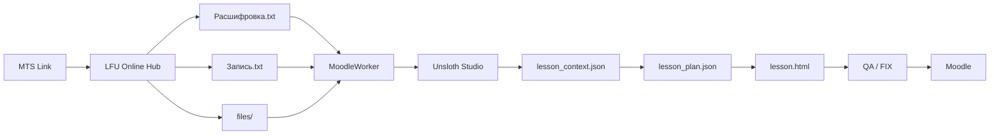

# Pipeline_MTSLink-Unsloth-Moodle

Нон-стоп конвейер:

**MTS Link → LFU Online Hub → папка урока → Unsloth Studio → MoodleWorker → Moodle HTML → QA → Moodle**

Репозиторий содержит исходники и готовый Windows x64 `MoodleWorker`, встроенный skill `moodle-lesson-builder`, документацию по структуре входных данных, авторизации Unsloth Studio и безопасному для Moodle/WAF HTML.

> Текущая рабочая версия MoodleWorker: **v0.5**.

## Что уже работает

- пакетная обработка 1–30+ уроков;
- очередь `queued / in_progress / done / needs_review / failed`;
- восстановление после остановки;
- отдельные stateless-запросы к LLM на этапах `EXTRACT → PLAN → BUILD → QA/FIX`;
- отсутствие накопления истории предыдущих уроков;
- авторизация в Unsloth Studio по паролю через `/api/auth/login`;
- автообновление JWT после `401`;
- автоматическое определение модели через `/v1/models`;
- WAF-safe проверка Moodle HTML;
- работа с `Расшифровка.txt`, `Запись.txt`, `files/`;
- DOCX/PPTX/XLSX/TXT/HTML и best-effort PDF extraction;
- опциональный Vision для изображений;
- WebUI + tray + watchdog.

## Быстрый старт

1. Подготовьте пакет уроков:

```text
.../output/2026-10-03/уроки/
├── 00_09_00_10А_Литература/
│   ├── Расшифровка.txt
│   ├── Запись.txt
│   └── files/
├── 01_10_00_10А_Физика/
│   ├── Расшифровка.txt
│   ├── Запись.txt
│   └── files/
└── ...
```

2. Запустите:

`bin/windows-x64/MoodleWorker.exe`

3. В WebUI укажите:
   - папку `.../уроки`;
   - `Unsloth Studio URL`, например `http://192.168.1.12:8888`;
   - пользователя `unsloth`;
   - пароль Studio.

4. Поля `API Base URL`, `Model ID`, `API key`, `Команда запуска Unsloth` можно оставить пустыми.

5. Нажмите **«Починить подключение»** или **«Войти и проверить API»**, затем **«Старт»**.

## Архитектура



## Pipeline одного урока

```text
INGEST
  ↓
EXTRACT → lesson_context.json
  ↓
PLAN → lesson_plan.json
  ↓
BUILD → lesson.html
  ↓
READ_BACK
  ↓
QA
  ├─ PASS → COMMIT → DONE
  └─ FAIL → FIX → QA
  ↓
RESET
  ↓
NEXT LESSON
```

Каждый LLM-этап отправляется отдельным запросом. Это и есть физическое/сетевое «обнуление» диалога: расшифровка урока №1 не переносится в запросы урока №2.

## Документация

Полная инструкция с изображениями:

- [`docs/index.html`](docs/index.html) — единая HTML-инструкция;
- [`docs/SETUP.md`](docs/SETUP.md) — настройка;
- [`docs/FOLDER_CONTRACT.md`](docs/FOLDER_CONTRACT.md) — структура файлов;
- [`docs/UNSLOTH.md`](docs/UNSLOTH.md) — Unsloth Studio;
- [`docs/MOODLE_SAFE_HTML.md`](docs/MOODLE_SAFE_HTML.md) — профиль Moodle/WAF;
- [`docs/TROUBLESHOOTING.md`](docs/TROUBLESHOOTING.md) — типовые ошибки.

Для GitHub Pages достаточно включить Pages через workflow `pages.yml`.

## Исходники

`apps/MoodleWorker/`

Сборка не использует внешних Go-модулей.

Windows x64:

```powershell
cd apps/MoodleWorker
$env:GOOS="windows"
$env:GOARCH="amd64"
$env:CGO_ENABLED="0"
go build -trimpath -ldflags="-s -w -H=windowsgui" -o dist/MoodleWorker.exe .
```

Или запустите `build_windows.bat`.

## LFU Online Hub v2.6

В `apps/LFU_Online_Hub_v2_6/` добавлена документация интеграционного контракта v2.6.

Известный выход LFU v2.6:

```text
output/<дата>/уроки/<урок>/
├── Запись.txt
├── Расшифровка.txt
└── files/              # только если есть вложения
```

Именно этот контракт напрямую понимает MoodleWorker.

Исходные бинарные файлы LFU v2.6 хранятся в пользовательской библиотеке, но их raw-байты не удалось перенести в рабочую среду этой сборки. Поэтому в репозитории подготовлено место и точный список исходных файлов для последующего добавления без реконструкции кода.

## Безопасность

Не коммитьте:

- Studio password;
- API keys;
- MTS token;
- ЭлЖур credentials;
- `API.txt`;
- `%APPDATA%/MoodleWorker/settings.json`;
- реальные расшифровки и записи учеников/преподавателей.

`.gitignore` уже исключает типовые секреты и runtime-файлы.

## Бинарный файл

`bin/windows-x64/MoodleWorker.exe`

SHA-256:

```text
66cb2e2c9b0cf551d9ef94878f66adc51813fc10c14f87321d11d7d405a13ebf
```

## Лицензия

Лицензия специально не выбрана автоматически. Перед публикацией репозитория выберите подходящий режим лицензирования.
